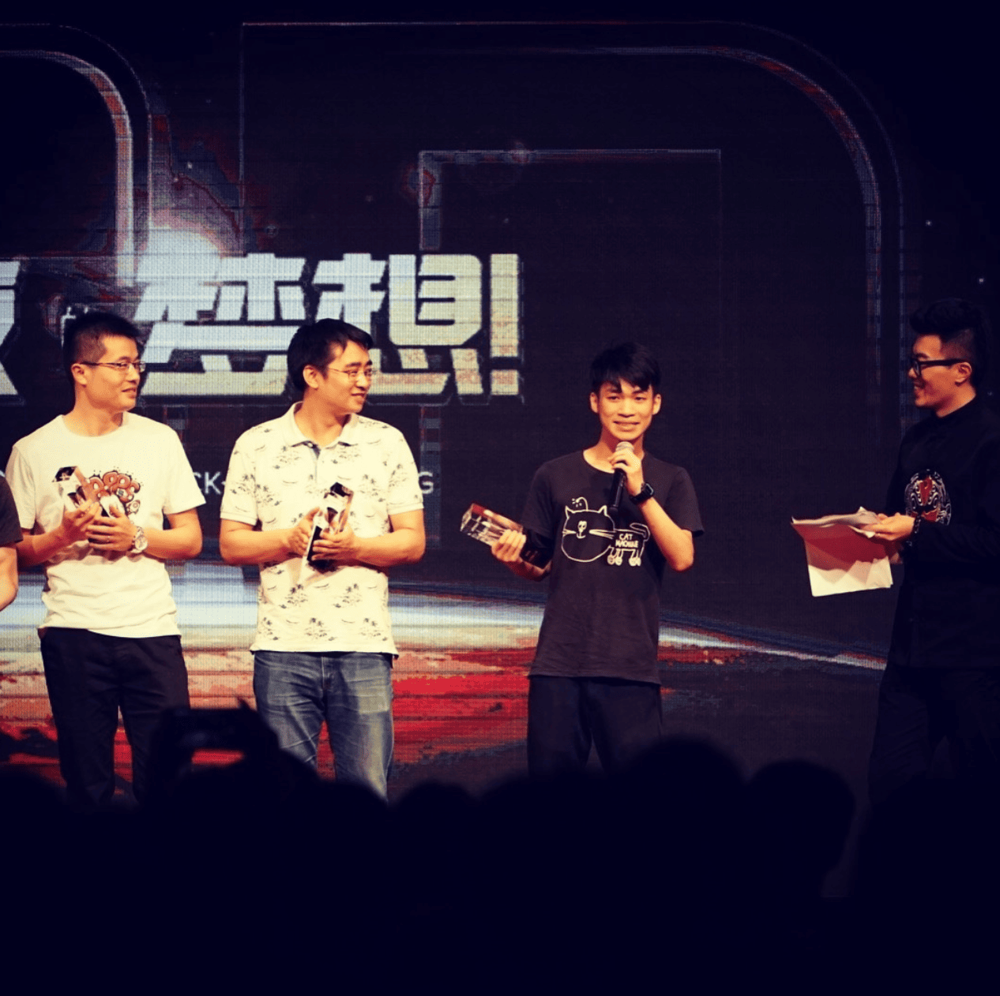
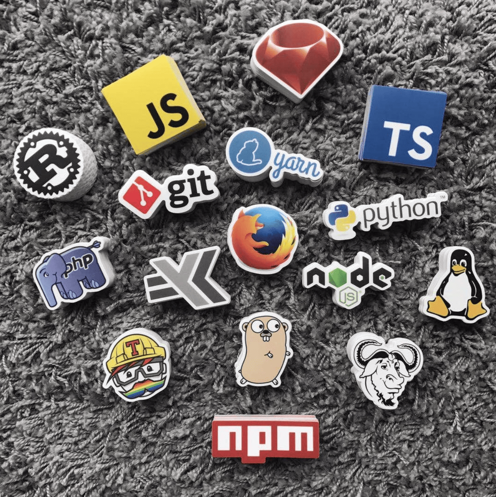

## Preface

我的 2017 过得很平淡，可能是因为出来工作已经是第二年了。

今年比较特别的是身边的朋友都大四了，参加了一些毕业拍照。大家都陆陆续续地开始找工作，面试。偶尔在朋友圈看到朋友拿到 offer, 也会替他们感到开心。

有很多朋友开始请教我一些出来工作的经验，面试的技巧、offer 怎么选择、租房的经验等等。被问到这些问题的时候我也会很开心。因为以前上学的时候，学业成绩不好，我在班上除了搞搞笑，对身边的同学来说并没有多大的「用处」。

4 月份的时候上台拿了 16 年的优秀新人奖，但是 17 年整一年没有做出很出色的成绩。慢慢失落地发现在很多事情上，技术并不是那么重要，它只不过是一种手段而已。

在年底，和 @EGOIST 一起创办了 [StickerOverflow](https://stickeroverflow.org). 成功地让国内的开发者能买到高质量的技术贴纸。

今年想得比较多的是应该如何用自己的能力去帮助更多的人。想过去做培训，想过回大学给以前班的人开个交流会，想过写书。最后都搁置了，因为我后来发现，「助人」有时是一件很一厢情愿的事。

除了技术外，这一年有很多新的尝试，上台唱歌纪念张国荣，参加了唱歌的比赛，做了一期[音乐电台节目](http://music.163.com/#/djradio?id=350672104)。在新的一年，还想尝试去经营一个音乐博客，让更多人发现被忽略的优秀粤语流行音乐和歌手。

## 新年计划

2018 年的计划是多写写代码，多玩玩音乐，读更多书，换一间大些的房子，买一辆车。

有次和朋友聊天，她说，你知道自己想要做什么，又能把它做到，还能靠它养活自己。你千万不能变得世俗啊，如果你也变得世俗，我会觉得这个世界，真的就是那样了。
