我从两年前开始放弃了所有笔记软件，换用 Apple Notes 记录我的所有笔记。这个举动缘于我读了 Tiago Forte 的一本书 The PARA method.

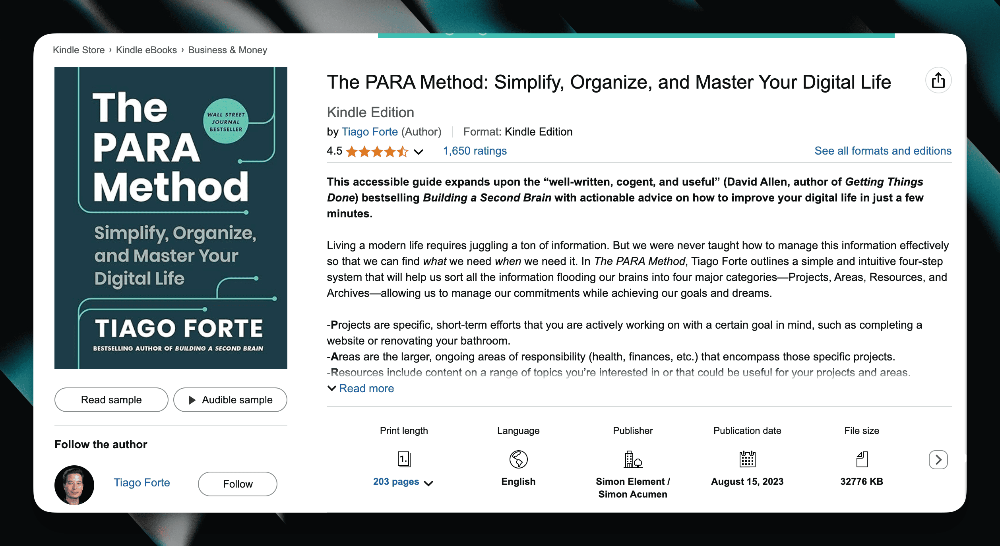

可能大家比较熟悉他的另一本书 Build The Second Brain, 是关于如何使用笔记软件构建自己的「第二大脑」。这本书也有提到他的 PARA 理论（我在我之前的文章也有提到过[我如何应用这个理论](/blog/how-do-i-take-note/)管理我的笔记）。两本书都读过以后，我认为 The PARA Method 这本书更偏向实操，我从中收获了更多的方法论。如果你只想读一本，那么我推荐读这一本。

读完这本书后，我立即在 Apple Notes 中基于 PARA 方法建立起了笔记组织的形式，这一套组织形式一直用到了两年后的今天都没有改变过。也就是说，这两年来，在做笔记时我再也没有花过时间去想应该如何组织我的笔记，光从这一点，就让我受益颇深，我可以没有任何心智负担地迅速记下我需要的东西，不用担心我应该怎么记，一切都是那么的简单。

这篇文章就是想和你分享我如何在 Apple Notes 记笔记，我在 PARA 的基础上根据我自己的实际场景做了一点小小的改良。希望对你也有所启发。

## 为什么是 Apple Notes

在分享方法论之前，我想先解释为什么我选择了 Apple Notes. 我认为 Apple Notes 有很多优点。

1. 它是系统自带的，我在手机、电脑上可以直接使用，不需要安装额外的 App
2. 它天然是支持同步的，不需要注册账号，不需要把资料上传到别人的服务器上。It just work.
3. 你可以直接在 Apple Notes 中粘贴文件、图片、音频，没有限额（严格地说这也占用你的 iCloud 存储，但我本身已经买了存储，这变成了边际成本）。
4. Apple Notes 打开的速度很快。

当然 Apple Notes 也有缺点，但两年使用下来，我没有因为这些缺点感到被限制，比如：

Apple Notes 支持的格式有限，只有最基本的列表、标题、加粗等等的文字样式格式。但我用下来发现，我根本不需要使用什么高级的格式。有人问我 Apple Notes 不支持代码块，你是怎么记代码相关的笔记的？我说我基本不会把代码片段作为笔记来记。比较多的场景是一些 JSON 格式的片段，我只会直接粘贴到笔记里，不加任何的格式。

我找到了两条比较经典的笔记：

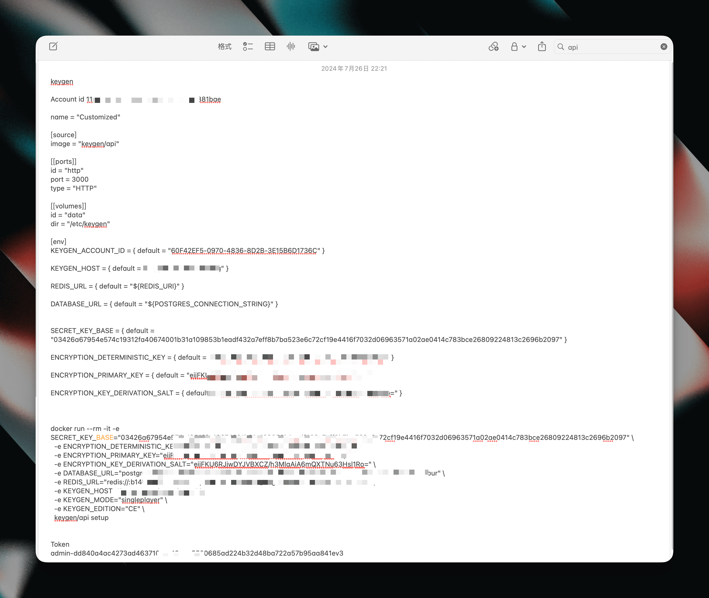

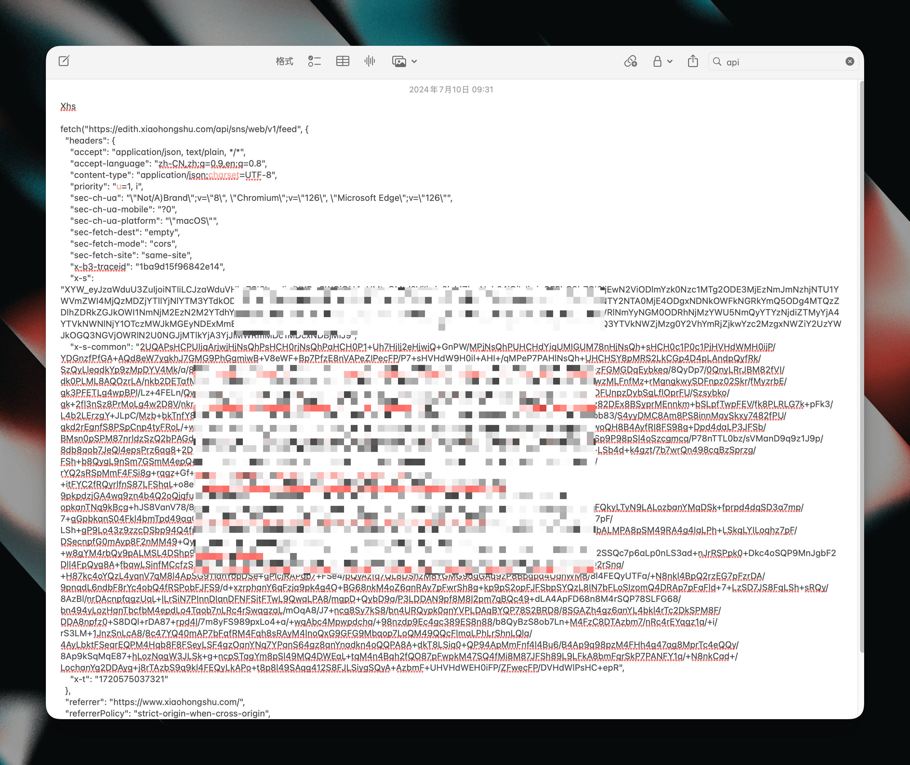

可以看到，里面不仅有 JSON, 还有 toml, 还有命令行。甚至还会有 spell check 的红线让它显示得很丑。但是我一点也不在意。**因为它们是拿来用的，不是拿来看的**，我不在乎它好不好看，只要我需要用到的时候能找到拿来用就好了。

也就是说，「美观」在我记笔记的需求里排不上什么优先级，我的最高优先级是能快速打开，快速记录，让我记东西的摩擦力降到最低。能帮我当下的想法、要处理的事情相关的信息记下来才是最重要的。所以我看过很多人把 Notion 模板做得很漂亮，也不为所动，因为对我来说这不是我需要的东西。不可否认，美观的笔记系统能给人情绪价值，它没有对错之分，只要合适自己就好。所以最重要的是知道自己是否需要，如果你认为这对你来说不是很重要，就回归简单吧。

Apple Notes 也没有「双链」功能，这是现代流行的笔记软件中很重要的功能，我在用 Logseq 的时候也被这个功能打动，因为它能把相关的笔记自然地关联到一起，带来额外的启发。最初用 Apple Notes 时我也担心会不会因此失去了这个优势，但用下来才发现，我并不是那么的需要它，即使没有，也没有让我感觉因为没有了他而失去了灵感。

Apple Notes 的标签功能也很弱，但我不使用标签。

## PARA 是什么

虽然在之前的博客也提到过 PARA, 但我还是想在这里简短地解释一下我所理解的 PARA 是什么。

PARA 的全称是 Project, Area, Resource, Archive. 翻译成中文就是「项目」「领域」「资源」「归档」。它代表了一个笔记应该放在什么地方以及一个笔记的流动过程。

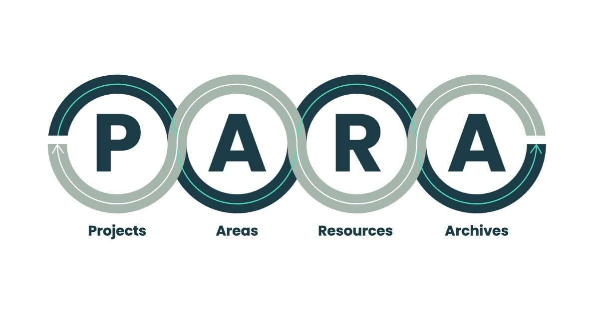

没错，在 PARA 的方法论中，笔记是可以「流动」的，它有时候在 Project, 当项目结束后，它不再被需要，就会流动到 Archive. 如果它在以后有利用价值，它可能会流动到 Area 或者 Resource.

	⁃	Project 指的是你现在正在进行的项目，比如你正在构思的一篇文章，你正在做的一个项目等等
	⁃	Area 指的是和你有关的领域，比如如果你是设计师，那么设计就是一个你的领域。
	⁃	Resource 指的是你会用到的资源，个人理解它和 Area 是一样的，只是优先级的不同。假如你是设计师，你偶尔会了解数字货币，但它在你生活中的优先级比较低，那么数字货币相关的笔记应该归类为 Resource
	⁃	Archive 指的是不再需要的笔记。通过我会把 Project 中完成的或者难产的项目拖动到 Archive. 

理解 PARA 的关键是理解 PARA 的哲学：**你记下的笔记应该要服务于你的行动**。

也就是说，在 PARA 的系统里，当你想要把东西记下来时，你的 mindset 应该是，这条笔记和我接下来的行动有什么关系？如果没有关系，那么它应该放在 Area 还是 Resource?

在 The PARA Method 一书中，开篇的一句话能解释这个哲学：

> Every word in this book is designed to do one thing: propel you forward into taking action
>
> 这本书中的每一个词都是为了一个目的：推动你付诸行动。

## Apple Notes 中的 PARA

简单了解了 PARA 后，看看我如何在 Apple Notes 中使用 PARA.

我在 Apple Notes 中会单独建立一个 PARA 目录：

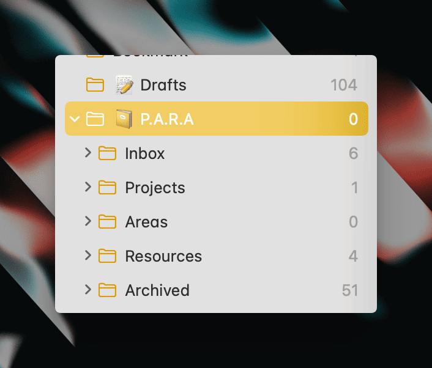

里面有基本的 Projects, Areas, Resources, Archived 文件夹。在这个基础上，我有两个改良，第一个是添加了一个 Drafts 文件夹，用于记录我日常的零碎想法：

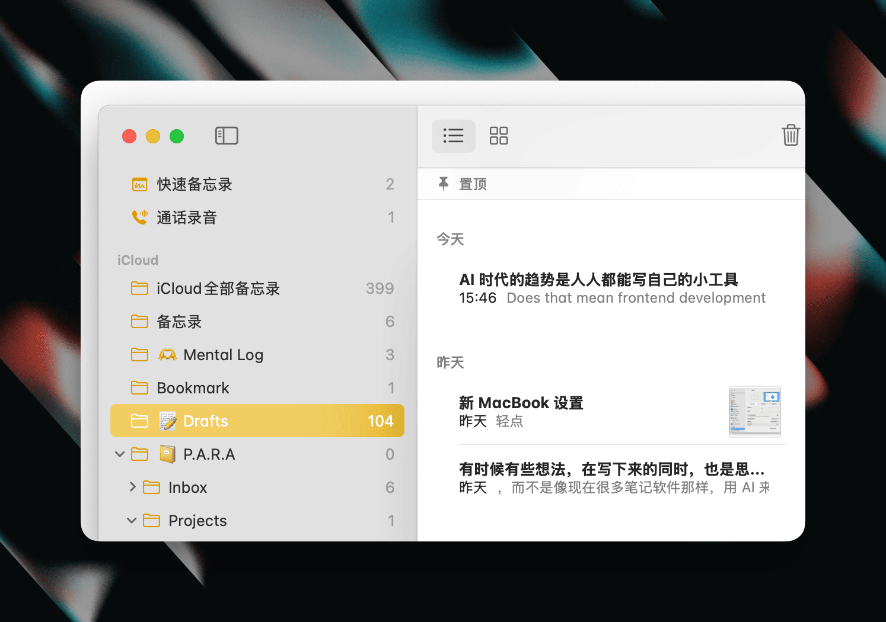

这些想法一般是在手机上记录下来，在有空的时候进行深度思考和研究，有些会最终成为一篇推文，或者基于想法变成一篇博客文章。

第二个改良是增加了一个 Inbox 文件夹，用来存放打算做的项目，这些项目还没进行深入的思考，不确定是否立项来做。如果想清楚要做，我会把它拖动到 Projects 中。否则直接拖到 Archive 归档。

Projects 目录是我最常用的，因为里面都是当前正在进行的项目：

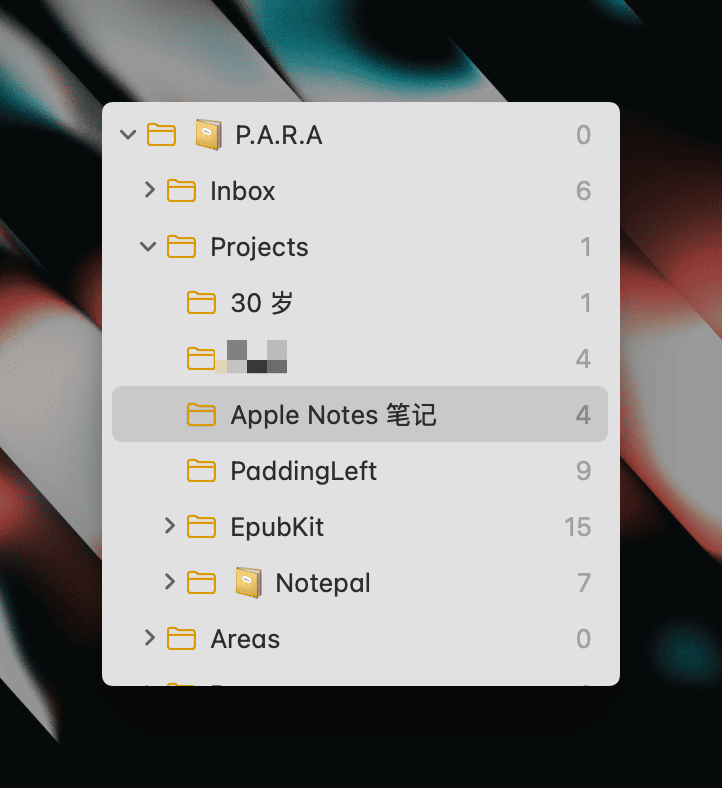

比如，当我决定要写一篇长文，就会在 Projects 中新建一个文件夹，比如现在这篇文章，就是在 Apple Notes 里写的。有了这个文件夹后，当我看到任何和这个项目相关的信息，就会把它记在这个文件夹当中：

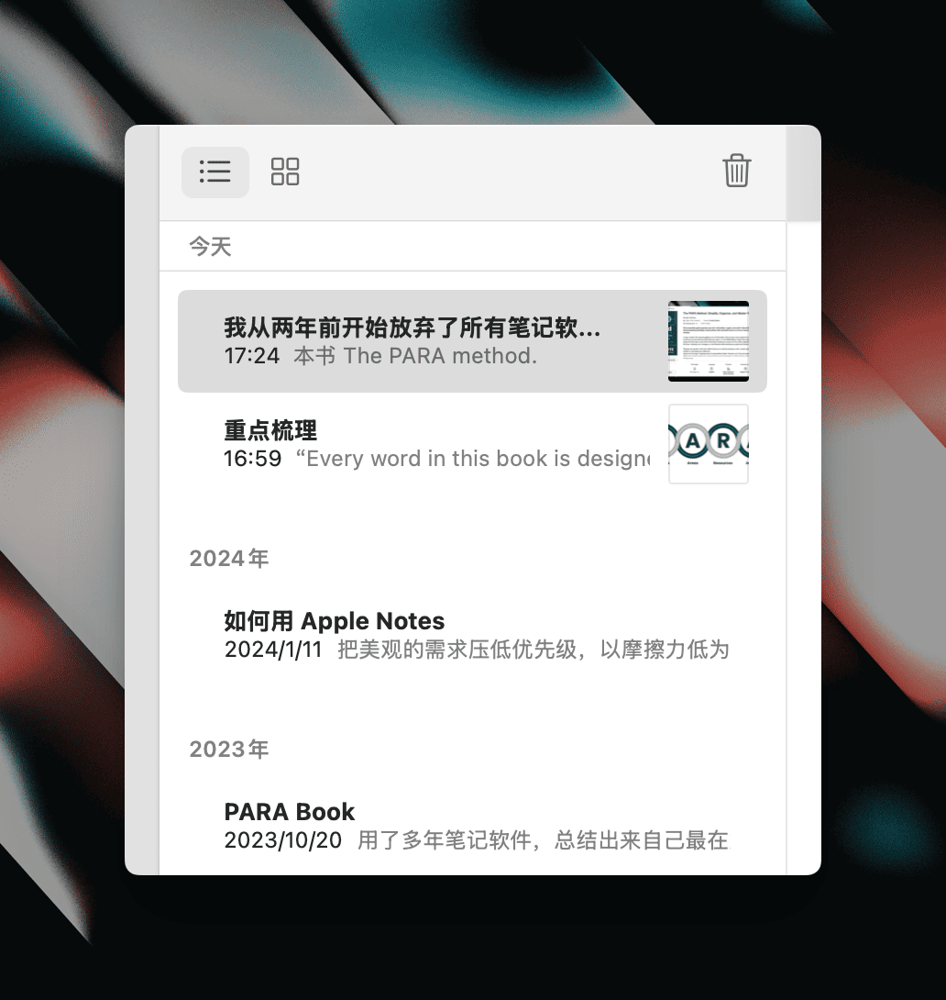

也就是说，当我看到任何关于 Note taking 主题的值得记下来的东西时，我很清楚要把它放在哪里，因为它和我正在进行的项目有关系。

这也解决了一个很普遍的问题，很多人想记笔记，想有「第二大脑」，却不知道应该记什么，或者记下来很多，最后都只是放在自己的笔记软件里，发挥不出任何作用。**而在 PARA 的系统中，你清楚地知道你应该记什么笔记，因为你知道哪些信息和你正在做的事情有关系。这些笔记才是真正能发挥作用的**。

比如我即将写一篇在我 30 岁时发布的博客文章，虽然还没开始写，但它是我的一个 Project, 那么当我读到和这个主题相关的信息，就会把它记在这个 Project 里，当我真正写这篇文章的时候，能直接参考它们，对于我来说，这才是有用的笔记：

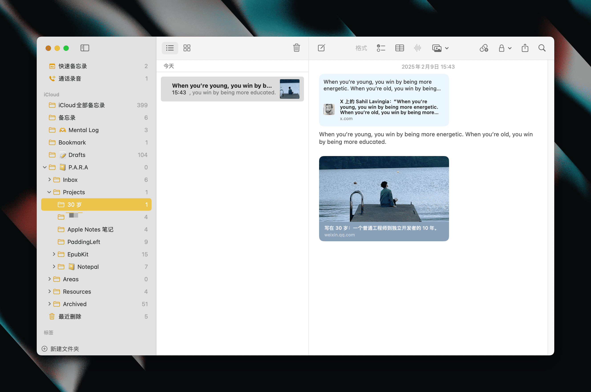

Projects 不仅仅是项目，它还可以是即将到来的一个事件(Event)，也可以是你正在研究的一个课题。比如你约了一个重要的人，你需要记下来这次约会需要准备点什么。约会结束后，就把它拖动到 Archive. 

再举一个例子，比如你正在开发一个软件，可能需要记一些技术相关的笔记。在以往，可能你会把这些笔记按主题记下来，比如 React, Vue, Rust, 前端, 后端之类的分类。但在 PARA 中，你应该为你正在开发的软件创建一个 Project，无论你想记下来的技术笔记是什么分类，都放到这个 Project 当中。这样记下来的笔记才是真正有价值的，因为它真实地服务于你正在开发的项目，你在开发时可以反复在一个地方参考。

项目结束后，你可以将整个 Project 拖到 Archive, 不需要再管它。如果你认为 Project 中的一些笔记有复用的价值，就把它拖到 Areas 或 Resources 当中。Apple Notes 的拖动十分方便。但按照我的经验，一般来说直接 Archive 整个 Project 也没什么问题，因为它不是被删了，你还是能通过搜索重新找到它。这时 Archive 的笔记又会「流动」到 Project 当中。

我自己的 Areas 和 Resources 其实很少碰，基本只在 Projects 和 Archive 中活跃：

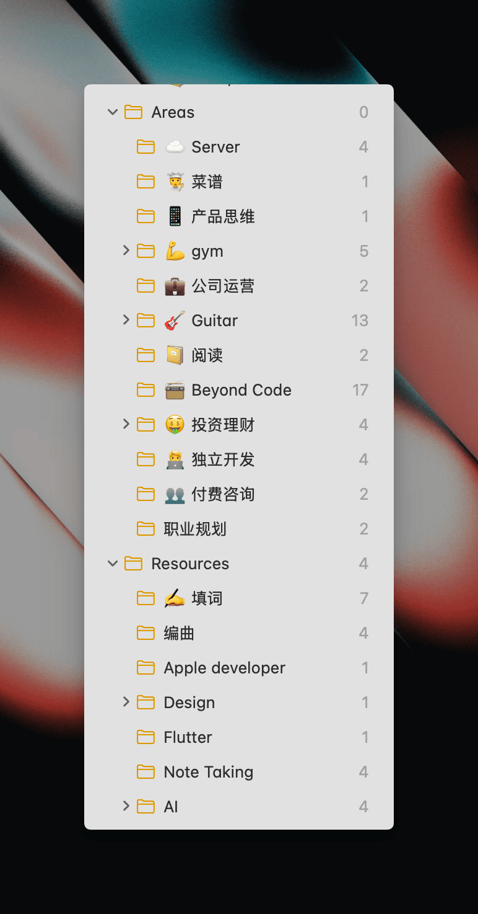

使用 PARA 的另一个好处在于，只要展开我的 Projects 目录，我能一目了然我正在做的事情。我不再需要单独的 Todo 工具，因为 Projects 就是我的 Todo, 而且 Apple Notes 也有 checklist 功能。这也是 The PARA Method 中所说的：

> You will gain greater focus on what matters most: You will have greater clarity about what’s important so you can intentionally move your life into alignment with your interests and goals.
>
> 你将更加专注于最重要的事情:你会更清晰地了解什么是重要的,从而有意识地将你的生活与自身兴趣和目标协调一致。

## 常见问题

### 没有双链，如何找回笔记

善用搜索。虽然只是关键字查询，但按照我的经验来看，这就足够了。比如我在 Apple Notes 记过我常用的 API key, 我只要搜索 azure 这个词，我就能立刻找到，我甚至都不知道它被我放在哪里了：

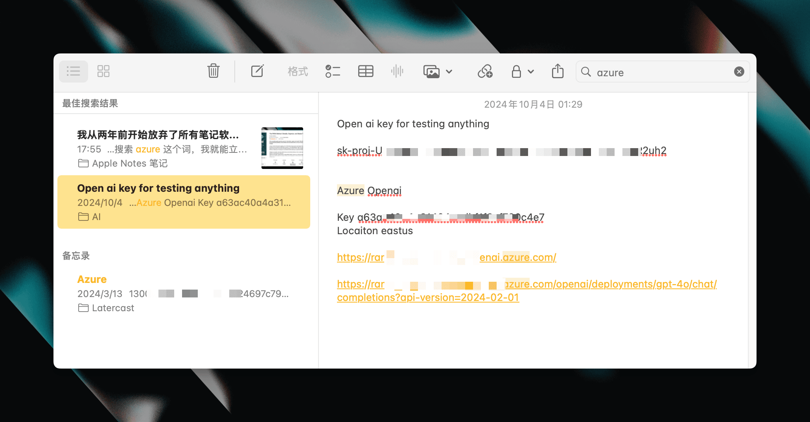

### 怎么把旧的笔记迁移过来

不需要迁移。在新的工具重新开始，需要用到的时候才在旧的工具重新找回，有必要时再复制过来。反正没人要求你用新的工具就把旧的数据都删掉。而且，我相信你最后会发现，你并不怎么需要找回你的旧数据 😂 这两年我就没打开过我以前一直用的 Logseq, 也没有做任何迁移。

## 结论

以上的分享不一定适合所有人，但它非常适合我，我也从这套系统中得到了很大的解放。你甚至可以什么系统都不用，在同一个文件夹记下来所有东西，最后你会意识到，重要的不是把笔记放在哪里，而是感谢自己当初记了下来。这就是为什么降低记录的摩擦力是如此地重要。

PARA 是一个方法，你不一定要用 Apple Notes, 你可以在所有的工具用它。不要让工具阻碍了自己最重要的事 —— take action. 真正有用的笔记是帮助你 take action 的笔记。

P.S. 这篇文章在 Apple Notes 写成：

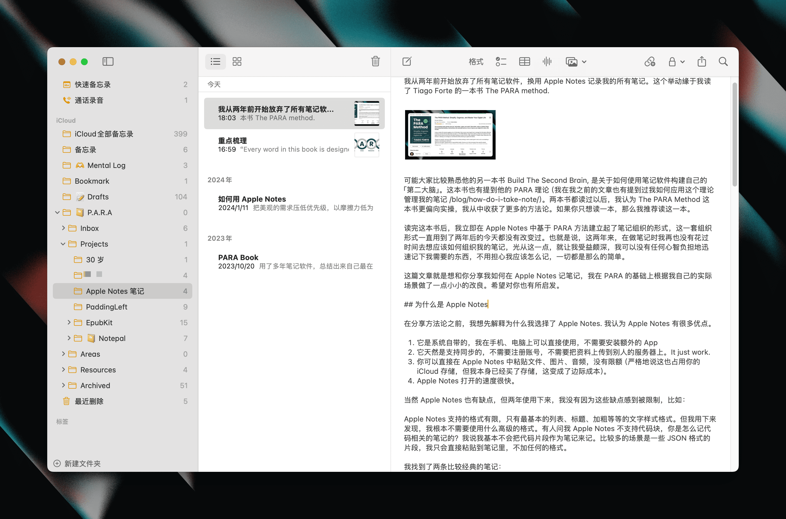