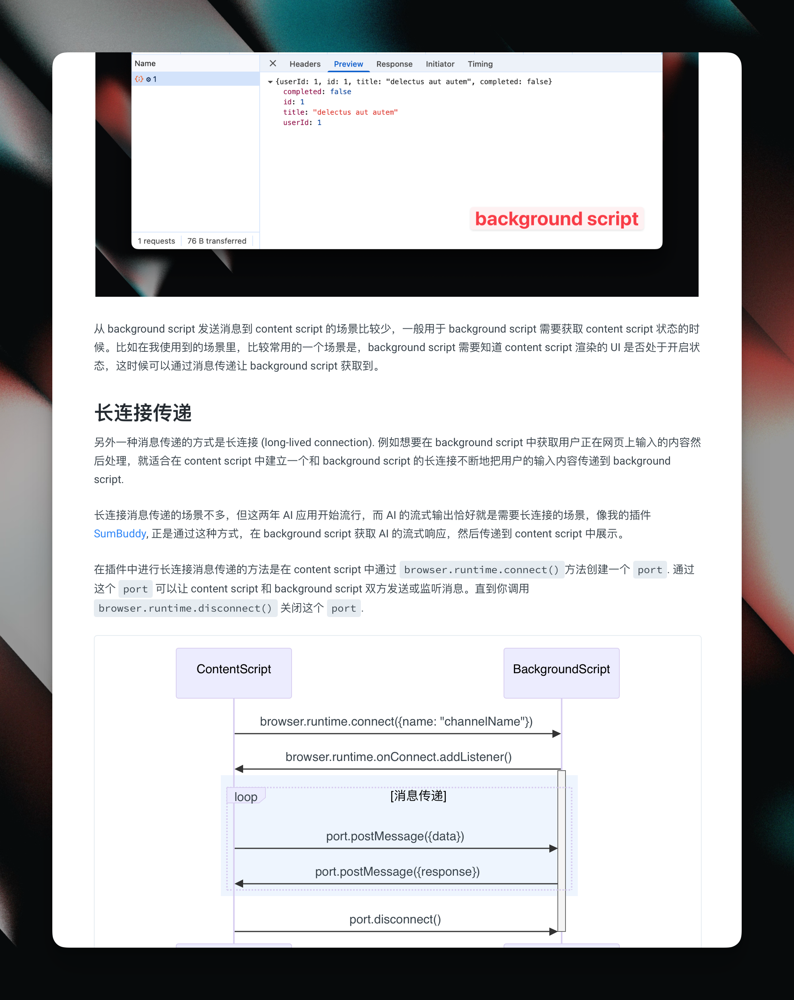

最近又写了一本小书。

这本小书定价 29 元，你可以在 [这里](https://mbd.pub/o/bread/aJeUkpZq) 购买 PDF 版本。如果你有特殊需求，也可以购买 [Markdown + PDF 版本](https://mbd.pub/o/bread/aJeUkppu)，价格是 49 元（为了增加盗版成本）。

> 这本书篇幅不长，但因为比较小众，所以定价稍高，请读者自行斟酌购买。

这是一本关于浏览器插件开发的书。这本书面向的是那些希望开发自己的浏览器插件满足自己需求的，也许你是专业的前端程序员，或是略懂前端代码的后端人员，在 AI 的加持下，大概都能从中受益。

之所以想写这本书，是因为我在过去一两年开发过不少浏览器插件（如微信读书笔记同步助手 [Notepal](https://notepal.randynamic.org), 浏览器 AI 助手 [SumBuddy](https://sumbuddy.app), 专注插件 [等等标签](https://dengtab.com/cn) 等等），积累了不少经验。这几年越来越多人开始做浏览器插件，尤其是在 AI 时代，浏览器插件作为重要的输入入口，能做的事情越来越多。我想可以把这些经验分享出来，让更多人可以开发满足自己需求的插件。

插件开发其实不是一件很难的事，特别是现在出现了一些成熟的框架，比如 [Plasmo](https://www.plasmo.com/docs), [WXT](https://wxt.dev/), [CRXJS](https://crxjs.dev/) 等。这些插件把代码构建、打包过程都封装得很好，开发者只需要关心插件的逻辑即可。

我自己用过 Plasmo 和 WXT, 这本书我会使用 WXT 进行教学。因为经过自己的长期实践，我认为 WXT 比 Plasmo 的设计更加合理，配套的工具更好用。当然每个框架有每个框架的利弊，即使你想使用其它框架，你还是能从这本书收获很多框架以外的知识，因为框架只是辅助。

另外，本书以 Manifest V3 为背景编写，不会讨论 Manifest V2 的内容。如果你不知道两者具体的区别，你也不需要知道（因为我也不知道）。简单来说 V3 比 V2 在安全性上做了更严格的控制，这一点虽然备受争议，但对于大部分的情况不会有太大的影响。

本书在涉及 UI 开发的部分我会使用 React, 这是我自己日常使用的库，对于使用 Vue, Svelte 等其它库的读者，也不需要担心，用什么框架并不是那么重要。并且 WXT 也支持不同的 UI 库。如果你想用其它库，翻看 WXT 的文档即可。

本书的实战中，我不引入任何样式库，因为会增加额外的和插件开发无关的复杂度。请读者不要计较实例的美观性。

读这本书前，我默认读者了解以下技术：

- 了解 JSON 这种数据结构
- 了解基本的 JavaScript/TypeScript, HTML, CSS 知识
- 有能力搭建 Node.js 开发环境

读完这本书后，读者能学习到开发一个浏览器最重要的几个知识点：

- 数据存储
- content script UI 的构建
- 消息传递

这几个知识点贯穿了所有实际场景必需的元素，我在开发自己的插件时，基本是围绕这三个基本的功能展开。至于其它更多的插件 API, 读者应该自己按照需求查看文档使用。

在讲解消息传递的实例中，我用 AI 消息流作为例子讲解，对于需要开发 AI 相关的浏览器插件的读者应该很有启发。

## 目录

- 概述
- 插件的基本结构
  - manifest
  - popup
  - content script
  - options
  - background script
- 插件 API
- 创建插件开发项目 
- 基本数据存储：Todo List 实战
- 进阶数据存储
  - 监听数据变动
  - 数据迁移 (Migration)
- Content Script 基本知识
  - 动态注入 content script
  - 在 content script 中渲染 UI
  - 真实环境中的一些经验
- 消息传递
  - 单次传递
  - 长连接传递
    - 实战： 渲染 AI 消息流
- 多语言支持
  - 插件原生多语言机制
  - 使用 i18next
- 附录
  - 最小权限原则
  - 处理用户登录
  - host permissions
  - 定时任务
  - 自动生成不同尺寸的 icon

## 一些预览

