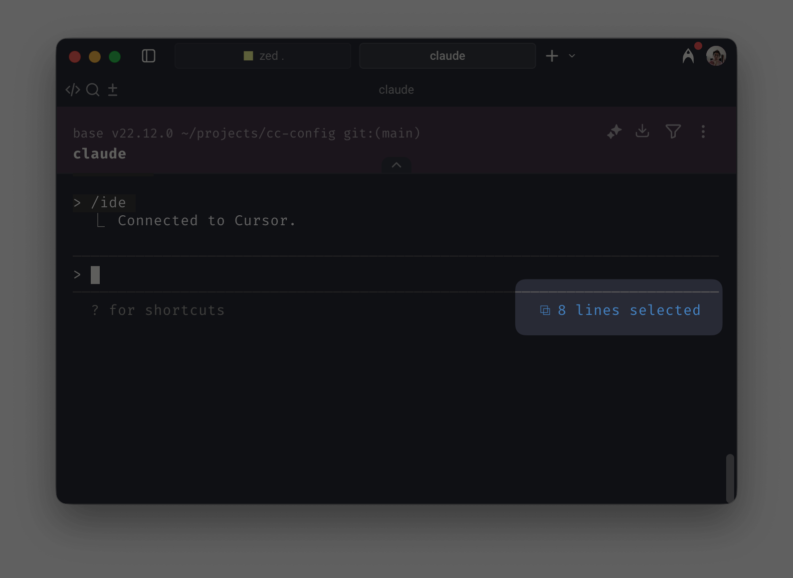
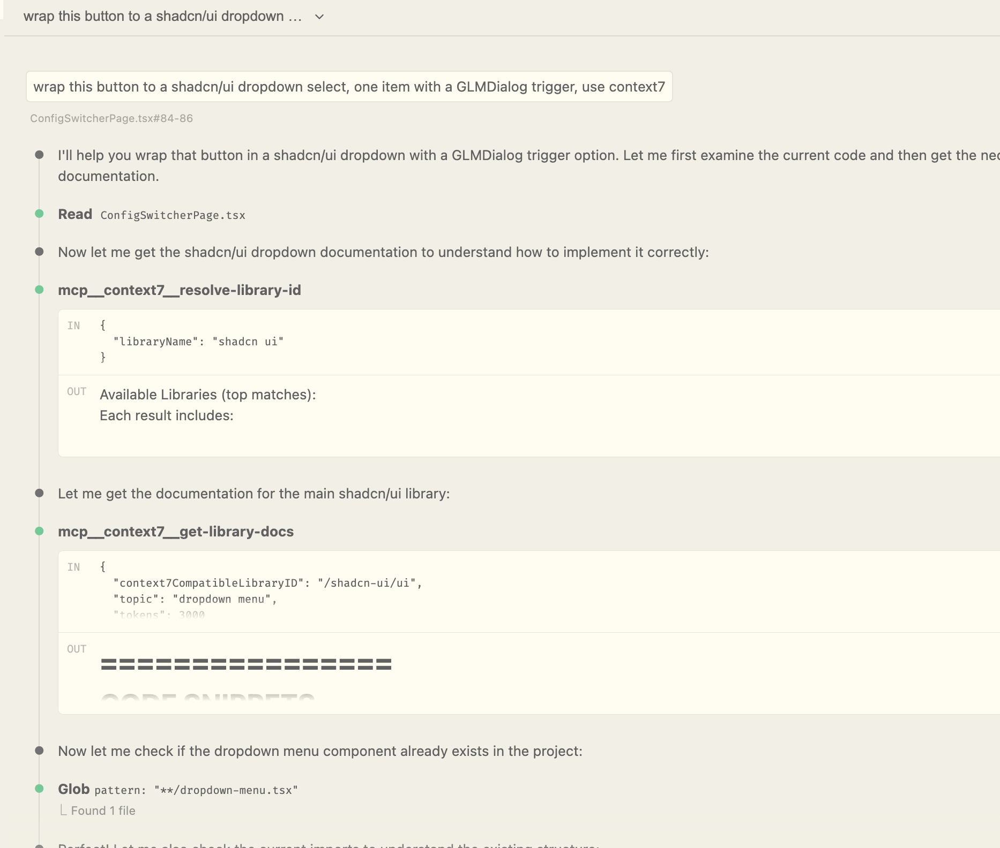
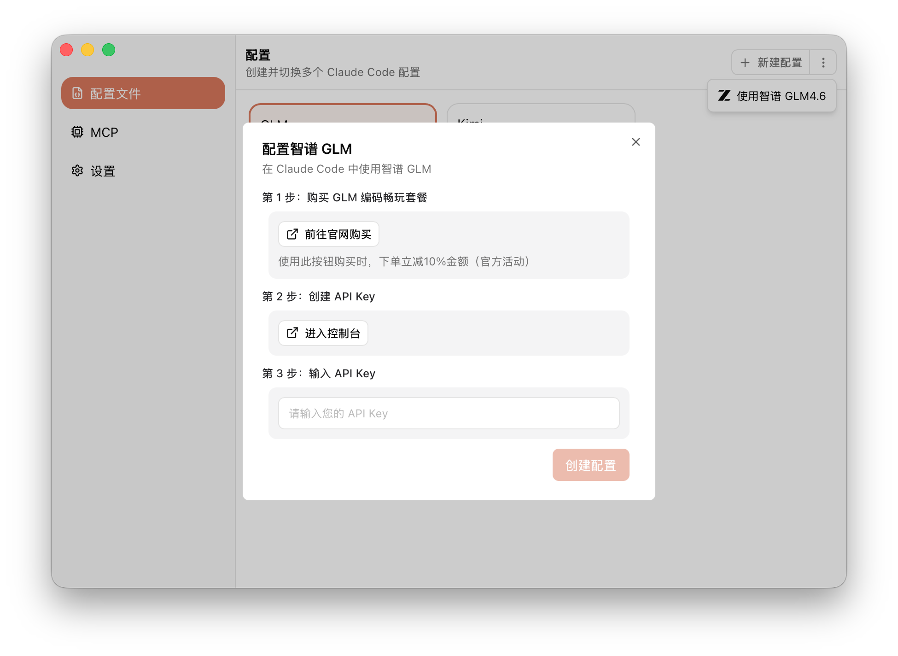
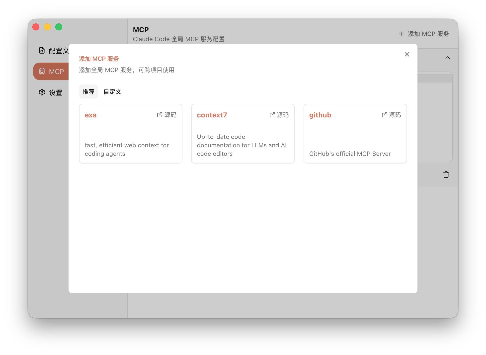

最近我在编程上一个很大的变化是把持续月付了将近 1 年的 Cursor 换成了 Claude Code. 之前一直不用 Claude Code 原因有二：

1. Claude Code 在中国使用非常困难，我已经算是比较愿意折腾的人了，也折腾不动它。在 Cursor 中使用 Claude 模型则非常方便。
2. 我不是很喜欢完全在 CLI 中 AI 编程，因为我使用 AI 编程的方式比较像 Copilot 而不是结对编程的形式。也就是说我喜欢在像 Cursor 这样的编辑器中，精确告诉 AI 要改动什么文件，或要针对哪几行的 code 进行改写。我认为在 Claude Code 中要做到这种「指哪打哪」非常困难。

这次转变的契机在于，上个月我竟然把 $20 的 cursor pro 额度花光了（我日常使用的是 Claude Sonnet 4），只能用 Auto Mode, 这使我的生产力断崖式地下降。这时候，恰好智谱推出了[「编码畅玩套餐」](https://www.bigmodel.cn/claude-code?ic=UP1VEQEATH)（并非广告，智谱看到的话可以联系我打钱），推出了兼容 Claude Code 的接口，价格还相当便宜。于是我开始再次尝试 Claude Code.

## Claude Code 使用体验

最初我还是非常不习惯不在 editor 里操作 AI, 因为觉得这样很没有安全感。不过在慢慢磨合之后感觉没有我想象中那么糟糕。

在 Claude Code 中可以使用 `/ide` 连接 IDE, 连接后 Claude Code 可以识别出当前 IDE 打开的文件是什么，这样能达到 Cursor 类似的效果。所以 Claude Code 也能得知我希望的是结合指定文件作为改动基准。

在 Cursor 中我还会手动 @ 不同的文件指定 AI 修改的文件，出乎我意料的是在 Claude Code 中 @ 文件的体验也相当不错，所以在体验方面，Claude Code 基本可以对齐我使用 Cursor 时的习惯。

另外一个常用的场景是我会选择具体的代码行让 AI 改动，这一点在 Cursor 做得很好。Claude Code 连接了 IDE 后也能识别到。



不过我感觉实际 Claude Code 并没有很「在意」我选的行，它经常会失控多改些东西，我不确定这是模型还是 Claude Code 的调校问题，我认为 Cursor 在这个场景是有做专门的 prompt 调校的。

Cursor 做得非常好的其中一个体验是它的 Restore, 你可以随时在 AI 改动的点撤销改动，也可以直接 Undo all 撤销整个会话的改动。这一点 Claude Code 还是逊色不少，现在我不得不在下一次改动前 git commit 我当前的改动。

Claude Code 2.0 之后新增了 `/rewind` 命令，也可以基于对话历史进行回撤，但远不如 Cursor 在 GUI 上做得好。而且如果你关闭了当前的对话后，也无法再进行回撤了。

在 Claude Code 中使用 MCP 一开始让我相当困惑。当我在项目路径通过 `claude mcp add` 安装 MCP 后，我发现在其它项目中并没有这个 MCP, 后来我才知道，需要指定安装的 scope, 默认是项目范围，如果要安装全局跨项目的 MCP, 需要加一个 `--scope user` 参数：

```
claude mcp add --transport http hubspot --scope user https://mcp.hubspot.com/anthropic
```

我使用的 MCP 只有 `exa` 和 `context7`, 这两个 MCP 都是用于查找文档的。我在 Cursor 中从来不用，因为 Cursor 可以直接在设置中输入文档地址进行索引，对话时用 @docs 就能把文档加到上下文中。这一块我还是喜欢 Cursor 的体验，当然 context7 和 exa 也能完成任务。

Claude Code 让我比较喜欢的是 Plan Mode. 对 AI 描述要做的事情，它先给你输出一份它的行动计划，我 review 完觉得 ok 才开始做，不 ok 就进一步沟通，直到满意为止。

## GLM 4.6 的体验

说实话在使用 GLM 之前，我对它的质量持怀疑态度。经过一个月深度使用后，我认为它远超了我的预期，并且个人感觉非常非常接近 Claude Sonnet 4 的水平（我用 Sonnet 4.5 还不多，所以无法对比）。

在此之前，我一直用的是 Sonnet 4, 可以说 Sonnet 4 和我磨合得已经相当好了，它就像跟了我一年的 engineer, 我对它的能力和做事风格相当地熟悉，所以能很好地彼此配合完成任务。因此在接触 GLM 4.6 的期间，我认为我是很有话语权把它们两个进行对比的。

首先是速度，GLM 4.6 在速度和质量取得了很好的平衡，平均速度我认为比 sonnet 4 更快一点点，偶尔抽风会特别慢。

质量上，我认为从 bug 的数量上来看，和 sonnet 4 没有我能感知到的差别。我的代码主要以前端 TypeScript 和 Rust 为主，在生成 Rust 代码时，GLM 和 sonnet 4 基本一样一气呵成，偶尔会有错误，但把错误日志再输入给它时，就能修好。

无论是前端还是后端还是什么语言，对于这两个模型，我的经验认为，只要你能给到足够的文档作为上下文（例如使用 exa, context7）, 效果都会非常好。因为生成功能性的代码主要需要的能力是按照文档进行推理，对于目前旗舰级的模型来说已经不是特别难的事。



而我认为最能体现一个模型真正的编程智能的任务是重构。因为模型 agent 需要自己对整个 codebase 进行理解、搜索、规划重构方案的流程不是照着文档抄那么简单。我特意使用了 GLM 对某个项目进行了技术栈的重构，比如在一个充满 useEffect 的 React 应用，我让它用 @tanstack/react-query 进行重构，GLM 十分出色地完成了任务，而且速度相当快，准确率很高，偶尔出错时，它自动参考 lint error 重新修改也能完成任务。

用一个比喻来总结 GLM 4.6 和 Sonnet 的对比，**我认为如果说 Sonnet 是 P7 级别的工程师，那么 GLM 4.6 是 P6+ 级别的。有时候 GLM 完成的任务，你需要再提醒多那么一句，它才能达到完美。**

但考虑到这是一个只需要 60 人民币一个月（首月 20）的模型，我觉得完全可以接受了。

## 如何配置 Claude Code 使用 GLM

顺便分享一下如果要在 Claude Code 中使用 GLM 需要怎么配置。

### 使用 CC Mate

最简单的方法是使用我最近做的 [CC Mate](https://randynamic.org/ccmate) 这个小工具。安装好 Claude Code 后，在 CC Mate 填一下 API Key, 所有的配置都会帮你处理好，这时打开 Claude Code 就已经是在使用 GLM 了。



CC Mate 支持多个配置随意切换，所以如果你想用 Kimi 也可以创建一个 Kimi 的配置。

另外 CC Mate 还有管理全局 MCP 的功能，你可以一键把我文中提到的 context7 和 exa 安装到全局 MCP 当中。



注意：安装完 MCP 后，需要在 Claude Code 中使用 `/mcp` 给它们登录授权。

### 手动配置

首先购买[「编码畅玩套餐」](https://www.bigmodel.cn/claude-code?ic=UP1VEQEATH), 然后新建一个 API key.

然后手动修改配置文件 `~/.claude/settings.json` 如下：

```json
{
  "env": {
    "ANTHROPIC_AUTH_TOKEN": "your-api-key",
    "ANTHROPIC_BASE_URL": "https://open.bigmodel.cn/api/anthropic",
    "ANTHROPIC_DEFAULT_HAIKU_MODEL": "GLM-4.5-Air",
    "ANTHROPIC_DEFAULT_OPUS_MODEL": "GLM-4.6",
    "ANTHROPIC_DEFAULT_SONNET_MODEL": "GLM-4.6",
    "ANTHROPIC_MODEL": "GLM-4.6"
  }
}
```

配置后，你能正常使用 Claude Code, 但你会发现，如果你使用 Claude Code 的 VS Code 插件，你是进不去的，它强制要求你先登录 Claude 账号。所以你需要再添加一个文件 `~/.claude/config.json`:

```json
{
  "primaryApiKey": "xxx"
}
```

`xxx` 只是一个占位符，什么内容都无所谓。

这时你就可以正常使用 Claude Code 的 VS Code 插件了 (这个配置在 [CC Mate](https://randynamic.org/ccmate) 中也已经帮你做好了)。

P.S. CC Mate 的开发过程完全使用 Claude Code + GLM 4.6, 基本 80% 的代码都是 AI 编写的，我只作为架构设计以及 UI 设计。