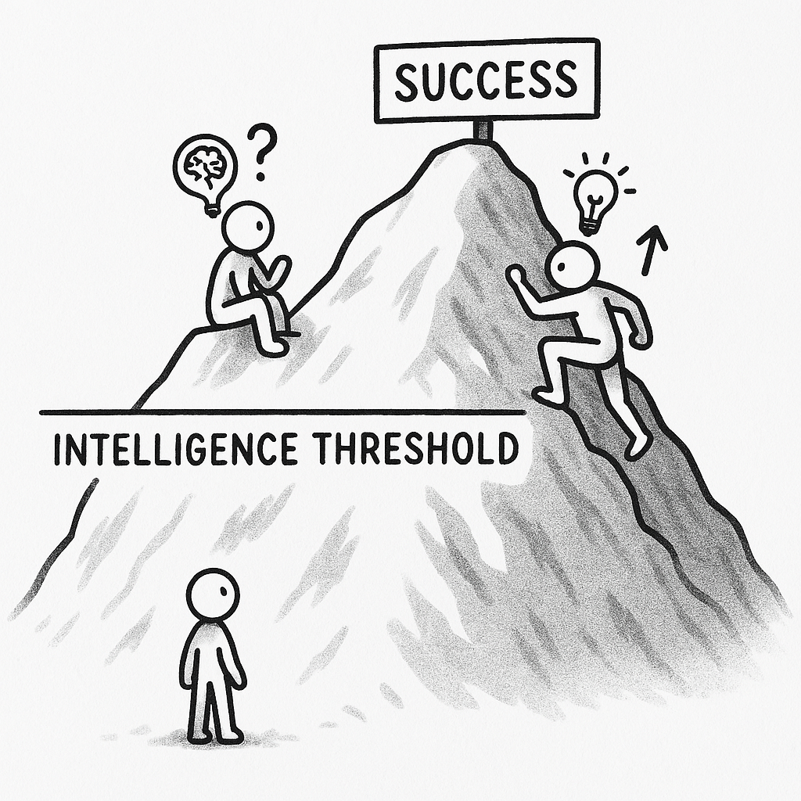

在 AI 越来越强大的这段时间里，我思考得比较多的一个问题是，我们是否高估了智力的重要性。

引起这个思考的原因有很多，一是大语言模型的进化程度让我感受到，语言模型在智能（推理、学习速度、知识广度等）方面已经远远超越人类，而这样的智能是每个人都能运用的。也就是说，人类完全可以把需要智能的行动交给 AI 处理，人类更多地是负责决策层面的工作。

二是因为我自己就是一个智力平平的人，小学当我学到除法的时候，我花了很长时间才理解除法是什么。我在开始学 JavaScript 的时候，也花了很长时间理解什么是 callback, 为什么函数能作为参数被传递和调用。

但我这个智力平平的人还是得到了算是不错的成果。我总是对别人说，我不是一个很聪明的人，我只是 13 岁就开始学编程，笨鸟先飞罢了，很多人大学学一年就能超过我的水平。所以我才更深刻地体会到，正常水平的技术，往往通过时间可以弥补，在这条水平线，不需要很高的智力。

不过，即使通过时间可以弥补智力的不足，但不是很多人能在这段时间里坚持下去。这也引出了我认为智力被高估的同时显现出来了另一个问题 —— 自我效能 (self-efficacy) 的重要性被远远低估了。

所谓的自我效能，是指相信自己有能力成功完成特定任务或应对特定情况的信心。很多复杂的因素决定了一个人自我效能的高低，这并非天生的。成长过程中长辈的态度、通过对他人的观察、个体与环境互动等等都影响一个人的自我效能水平。

在同样面对一个问题，自我效能低的人，看到的往往全是问题，最终放弃。而自我效能高的人，有强大的信念认为可以解决问题。前者也许在智力上比后者更高，但后者可以通过这种信念一直前进，超越前者。

尤其是在 AI 时代，智力变成了一种更容易弥补的差距。我认为智力是边际效益递减的，除非超过了某个阈值。但这永远是很小一部分的人。像我这样智力平平的人是多数，我们只是站在了巨人的肩膀上。就像 Dijkstra 只有一个，这个世界也需要他这样的天才，但我们还是可以享受他给我们带来的成果。

这不是反智，而是我认为，智力水平有一个临界点，对于临界点以下的人，智力的重要性被高估了，因为智能越来越不稀缺，稀缺的是自我效能，是主动利用智能的人。

自我效能是完全可以通过后天训练的。自我效能是心理学家 Albert Bandura 提出的概念。他总结了影响自我效能的四种因素：

### 掌控经验 (Mastery Experiences)

个体通过亲身成功完成任务的经验来建立自信。反复的成功会增强自我效能，而失败（尤其是早期或没有应对策略时的失败）则会削弱它。

我觉得这里指的「成功」并非大成功，而是细微的成功。例如在我学习编程的早期，我通过写出各种各样的小程序获得这种成功感，对我建立技术自信有很大的帮助。

### 替代经验 (Vicarious Experiences / Modeling)

观察与自己相似的人成功完成任务，会提升观察者对自己也能做到的信念。看到别人能行，会觉得“我也许也可以”。

对我来说，小时候读的名人（科技精英）传记就是一种 Modeling, 尤其是李开复的《世界因你不同》，这些「洗脑」式的输入，会让我越来越希望自己能成为这样的人。

乔布斯有一句广为流传的话，他说

> Life can be much broader once you discover one simple fact: Everything around you that you call life was made up by people that were no smarter than you.
>
> 一旦你认识到一个简单的事实——你周围那些你称之为“生活”的东西，都是由并不比你聪明的人创造出来的——你的人生就会变得更为广阔。

乔布斯从更极端的思路获得高度的自我效能感 —— 通过对比别人不行，觉得自己可以。

### 社会说服 (Social Persuasion):

受到他人的鼓励和积极评价可以增强自我效能感。而负面评价则会削弱它。

这个条件比较被动，这里不谈。

### 生理与情绪状态 (Physiological and Emotional States)

个体在面对任务时的生理反应和情绪状态会被解读为自身能力的信号。如果将紧张解读为“我不行”的证据，自我效能会降低；如果解读为“兴奋”或“迎接挑战”，则可能不会降低甚至会提升。

在这个方面，我面对舞台的经验可以充分论证。记得第一次面对众人做技术分享和第一次上台唱歌，我紧张得不行，表现都很糟糕。随着不断地强迫自己上台，我发现自信完全取决于自己的念头，我学会在上台前欺骗自己是一个有很多粉丝的人，台下的人对我非常崇拜，或很喜欢听我唱歌，这样的念头让我在台上的表现有很大很大的改进。

人是事件的反应器，通过刻意训练，是可以掌控自己的反应的。

以上是我对 AI 时代的到来的其中一点思考，希望能鼓励到和我一样智力平平的人。